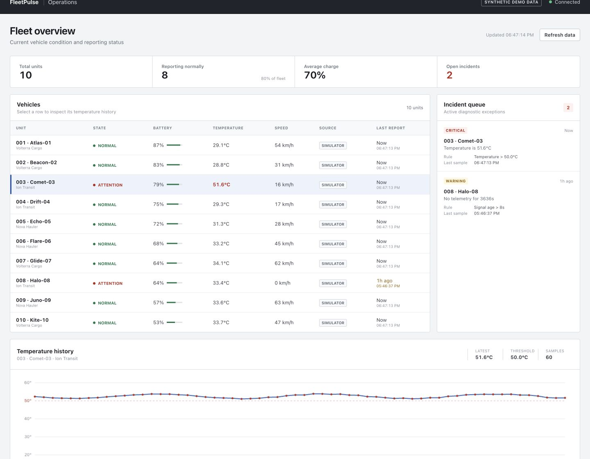
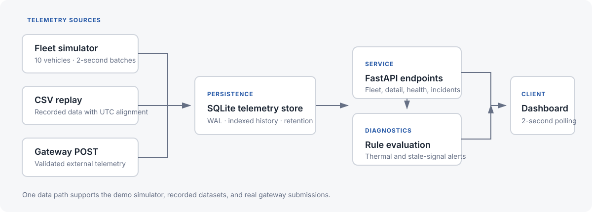

# FleetPulse

[](https://github.com/aaravsinglaa/fleetpulse/actions/workflows/ci.yml)

FleetPulse is a small fleet-operations application built with FastAPI, SQLite, and plain HTML/CSS/JavaScript. It collects battery level, temperature, speed, timestamp, and data-source information for 10 electric vehicles. Diagnostic rules flag temperatures above 50°C and vehicles that have not reported for more than eight seconds.

The project is transparent about its data. A built-in simulator makes the demo immediately runnable, while a validated ingestion endpoint and CSV replay command show how recorded or gateway data enters the same pipeline.



## Features

- Ten-vehicle simulator writing a fleet batch every two seconds
- SQLite telemetry history with WAL mode and a vehicle/timestamp index
- Operations-focused dashboard with a dense vehicle table and incident queue
- Selectable vehicle rows with a 60-sample temperature history chart
- Visible provenance for simulator, CSV replay, and external gateway readings
- Pure, separately tested thermal and stale-signal diagnostic rules
- No frontend build system or external chart dependency

## Run locally

Requires Python 3.11 or newer. In the VS Code terminal:

```bash
python3 -m venv .venv
source .venv/bin/activate
pip install -r requirements.txt
uvicorn app.main:app --reload
```

Open [http://127.0.0.1:8000](http://127.0.0.1:8000). API documentation is available at [http://127.0.0.1:8000/docs](http://127.0.0.1:8000/docs).

The application creates `fleetpulse.db` on first launch. `Comet-03` intentionally runs hot and `Halo-08` intentionally stops reporting so both diagnostic paths stay visible. The interface labels this feed as synthetic demo data.

Telemetry history is retained for seven days by default. FleetPulse removes expired history at
startup and once per hour while the simulator runs, while preserving every vehicle's latest reading.
Set a different positive duration with `FLEETPULSE_RETENTION_HOURS`, for example:

```bash
FLEETPULSE_RETENTION_HOURS=24 uvicorn app.main:app --reload
```

## API

| Method | Route | Purpose |
| --- | --- | --- |
| `GET` | `/vehicles` | Latest reading, source, incidents, and state for all vehicles |
| `GET` | `/vehicles/{id}` | Metadata and recent telemetry history; accepts `?history=1..200` |
| `GET` | `/incidents` | Current high-temperature and stale-telemetry exceptions |
| `POST` | `/telemetry` | Submit one validated reading from an external client |
| `GET` | `/health` | Database connectivity, simulator state, reading count, and retention |

Example gateway submission:

```bash
curl -X POST http://127.0.0.1:8000/telemetry \
  -H "Content-Type: application/json" \
  -d '{
    "vehicle_id": 1,
    "battery_pct": 72.4,
    "temperature_c": 38.6,
    "speed_kph": 46.0,
    "timestamp": "2026-09-03T16:30:00-04:00",
    "source": "sensor_gateway"
  }'
```

The API validates vehicle IDs, timezones, battery range, temperature range, speed range, and the permitted source values. Authentication is deliberately out of scope for this local portfolio project.

## Replay recorded data

The included CSV command imports readings directly into the same SQLite telemetry table. By default, it preserves the spacing between samples but moves the final timestamp to the current time:

```bash
python replay_csv.py data/sample_telemetry.csv
```

Use `--keep-timestamps` when the original dates should remain unchanged, or `--database path/to/file.db` to target another database. A compatible file needs these columns:

```text
vehicle_id,battery_pct,temperature_c,speed_kph,timestamp
```

The included sample is synthetic and exists to demonstrate the replay format. It can be replaced with a real recorded dataset after mapping its fields to this schema.

## Verify

```bash
pip install -r requirements-dev.txt
ruff format --check .
ruff check .
pytest -q
python benchmark.py
```

GitHub Actions runs the formatting, lint, and test checks on Python 3.11 and 3.12 for every
push and pull request.

## Architecture



```text
Simulator ─────────┐
CSV replay ────────┼──> SQLite telemetry history ──> FastAPI ──> Operations dashboard
Gateway POST ──────┘              │
                                  └──> thermal and stale-signal rules
```

Incidents are calculated from each vehicle's newest sample rather than stored as a second source of truth. Polling is appropriate for a 10-vehicle local demo and avoids unnecessary WebSocket infrastructure. The browser chart uses the Canvas API, so there is no CDN or frontend package manager.

## Measured result

The repeatable benchmark documented in [`BENCHMARK.md`](BENCHMARK.md) inserted 10,000 readings and evaluated the latest fleet state in a five-run median of **9.7 ms**, approximately **1.03 million readings/second** on the measured development machine. This is a local SQLite batch result, not an HTTP or production-scale claim.

Suggested resume bullet:

> Built a FastAPI/SQLite fleet telemetry system with simulator, CSV replay, validated gateway ingestion, indexed history, and automated thermal/staleness diagnostics; processed and evaluated a 10,000-reading batch at ~1.03M readings/second in a repeatable local benchmark.
